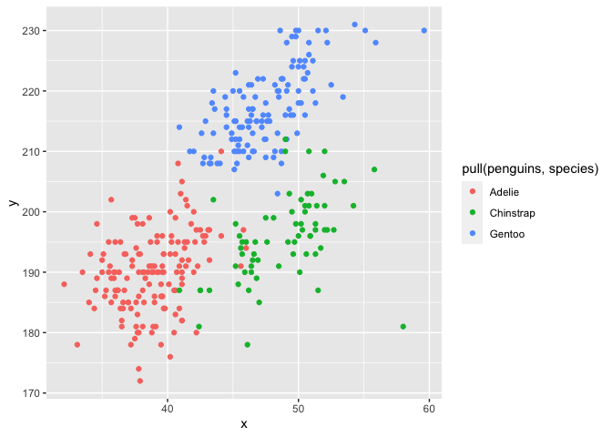

Homework 1
================
Jinghan Zhang
September 10, 2020

## Problem 1

## Create a data frame comprised of:

  - a random sample of size 10 from a standard Normal distribution
  - a logical vector indicating whether elements of the sample are
    greater than 0
  - a character vector of length 10
  - a factor vector of length 10, with 3 different factor “levels”

<!-- end list -->

``` r
  library(tidyverse)
```

    ## ── Attaching packages ────────────────────────────────────────────────────── tidyverse 1.3.0 ──

    ## ✓ ggplot2 3.3.2     ✓ purrr   0.3.4
    ## ✓ tibble  3.0.3     ✓ dplyr   1.0.2
    ## ✓ tidyr   1.1.2     ✓ stringr 1.4.0
    ## ✓ readr   1.3.1     ✓ forcats 0.5.0

    ## ── Conflicts ───────────────────────────────────────────────────────── tidyverse_conflicts() ──
    ## x dplyr::filter() masks stats::filter()
    ## x dplyr::lag()    masks stats::lag()

``` r
  problemone_df = tibble(
    vec_numeric = rnorm(10),
    #vec_positive = samp > 0,
    vec_logical = c(vec_numeric > 0),
    vec_char = c("a", "b", "c", "d", "e", "f", "g", "h", "i", "j"),
    vec_factor = factor(c("sad", "angry", "happy", "angry", "sad", "sad", "sad", "happy", "angry", "angry"))
)
```

Try to take the mean of each variable in your dataframe. What works and
what doesn’t?

``` r
  mean(pull(problemone_df, vec_numeric))
```

    ## [1] -0.1062879

``` r
  mean(pull(problemone_df, vec_logical))
```

    ## [1] 0.5

``` r
  mean(pull(problemone_df, vec_char))
```

    ## Warning in mean.default(pull(problemone_df, vec_char)): argument is not numeric
    ## or logical: returning NA

    ## [1] NA

``` r
  mean(pull(problemone_df, vec_factor))
```

    ## Warning in mean.default(pull(problemone_df, vec_factor)): argument is not
    ## numeric or logical: returning NA

    ## [1] NA

**The variables for which I can take the mean are the random sample of
double values and logical vector. It does not work for the char vector
or factor vector.**

In some cases, you can explicitly convert variables from one type to
another. Write a code chunk that applies the as.numeric function to the
logical, character, and factor variables (please show this chunk but not
the output). What happens, and why? Does this help explain what happens
when you try to take the mean?

``` r
  as.numeric(pull(problemone_df, vec_logical))
  as.numeric(pull(problemone_df, vec_char))
  as.numeric(pull(problemone_df, vec_factor))
```

**The logical and factor vectors are able to be converted. By applying
as.numeric to the logical vector, values are generated with 0 for FALSE
and 1 for TRUE. By applying as.numeric to the factor vector, values are
generated with 1-3 for the corresponding factor “levels”. However, there
is an error for the char vector because there is no corresponding
numeric value that can be assigned.**

## In a second code chunk:

  - convert the logical vector to numeric, and multiply the random
    sample by the result
  - convert the logical vector to a factor, and multiply the random
    sample by the result
  - convert the logical vector to a factor and then convert the result
    to numeric, and multiply the random sample by the result

<!-- end list -->

``` r
  as.numeric(pull(problemone_df, vec_logical))*pull(problemone_df, vec_numeric)
```

    ##  [1] 0.2238750 0.0000000 0.0000000 0.0000000 0.0000000 0.0000000 1.1136798
    ##  [8] 0.5965940 0.0749255 0.4237377

``` r
  factor(pull(problemone_df, vec_logical))*pull(problemone_df, vec_numeric)
```

    ## Warning in Ops.factor(factor(pull(problemone_df, vec_logical)),
    ## pull(problemone_df, : '*' not meaningful for factors

    ##  [1] NA NA NA NA NA NA NA NA NA NA

``` r
  as.numeric(factor(pull(problemone_df, vec_logical)))*pull(problemone_df, vec_numeric)
```

    ##  [1]  0.44775007 -0.03534960 -1.64905699 -0.42824704 -1.30640299 -0.07663434
    ##  [7]  2.22735953  1.19318808  0.14985100  0.84747539

## Problem 2

``` r
  data("penguins", package = "palmerpenguins")
```

## Write a short description of the penguins dataset (not the penguins\_raw dataset) using inline R code, including:

  - the data in this dataset, including names / values of important
    variables
  - the size of the dataset (using nrow and ncol)
  - the mean flipper length

**The data in the penguins dataset is stored in a tibble, with 344
observations (rows) and 8 categories/variables (columns) for each
observation. These variables specifically studied are species, island,
bill\_length\_mm, bill\_depth\_mm, flipper\_length\_mm, body\_mass\_g,
sex, year. The mean flipper length is 200.9152047 mm.**

Make a scatterplot of flipper\_length\_mm (y) vs bill\_length\_mm (x);
color points using the species variable (adding color = … inside of aes
in your ggplot code should help).

``` r
  plot_penguins = tibble(
  x = pull(penguins, bill_length_mm),
  y = pull(penguins, flipper_length_mm)
)

ggplot(plot_penguins, aes(x = x, y = y, color = pull(penguins, species))) + geom_point()
```

    ## Warning: Removed 2 rows containing missing values (geom_point).

<!-- -->

Export your first scatterplot to your project directory using ggsave.

``` r
  ggsave("plot_penguins.png")
```

    ## Saving 7 x 5 in image

    ## Warning: Removed 2 rows containing missing values (geom_point).
